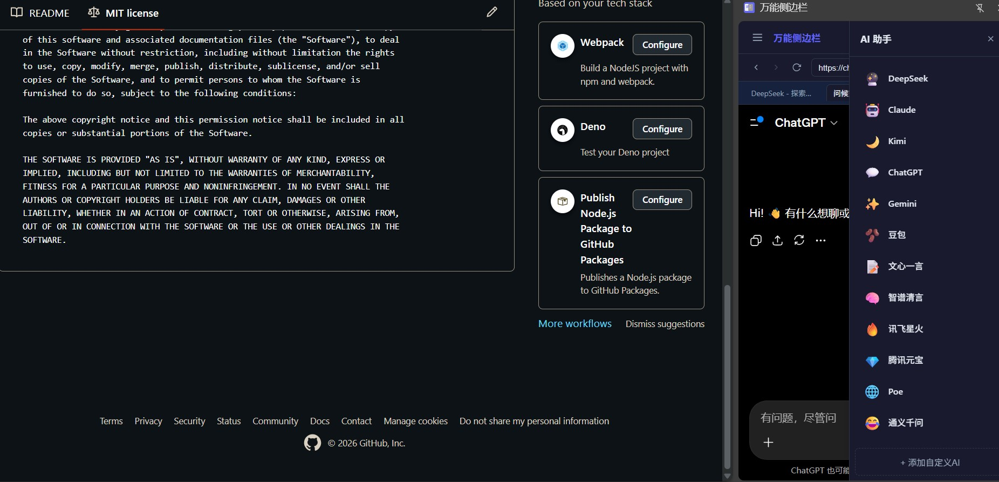
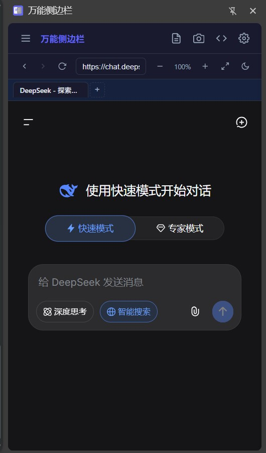

# Universal Sidebar

A browser sidebar extension that integrates any AI chat platform into the sidebar. Supports Chrome/Edge.

## 💡 Usage

**Zero setup required, works right out of the box.**

If your browser is already logged into an AI platform (DeepSeek, ChatGPT, Claude, etc.) and the session is still valid, you can **start chatting immediately** after opening the sidebar — no need to log in again.

If your session has expired, or you want to use a new AI platform, simply **log in directly within the sidebar**, just like you would in a regular browser.

> The sidebar is essentially an embedded browser that shares cookies with your main Chrome browser. As long as you've logged in via the main browser, the sidebar works instantly.

## 📸 Screenshots

| AI Platform List | Chat Interface |
|:----------------:|:--------------:|
|  |  |

## ✨ Features

- **Multi-tab Browser** — Open any webpage in the sidebar with multi-tab support
- **One-click AI Switching** — Pre-configured with DeepSeek, Claude, ChatGPT, Gemini, Kimi, and more; supports custom additions
- **Page Content Extraction** — Convert any webpage to Markdown format with one click
- **Area Screenshot** — Select any region of a webpage; the screenshot is auto-copied to clipboard and pasted into the AI chat input
- **Video Subtitle Extraction** — Extract and display subtitles from YouTube, Bilibili, and other platforms
- **Dark Mode** — Light, dark, and system-following theme options
- **Page Zoom** — 50% to 200% zoom control
- **Fullscreen Mode** — Browse in fullscreen within the sidebar

## 📦 Installation

1. Download or clone this repository
2. Open Chrome and navigate to `chrome://extensions/`
3. Enable **Developer mode** in the top-right corner
4. Click **Load unpacked** and select this project directory
5. Click the extension icon in the Chrome toolbar to open the sidebar

## 🔒 Permissions

| Permission | Purpose |
|------------|---------|
| `sidePanel` | Create the sidebar panel |
| `activeTab` | Access current tab information |
| `storage` | Save user settings and tab state |
| `tabs` | Manage multiple tabs |
| `clipboardWrite` | Copy screenshots to clipboard |
| `scripting` | Inject content scripts |
| `declarativeNetRequest` | Remove iframe restrictions for embedding websites |
| `webNavigation` | Monitor navigation changes inside iframes |
| `cookies` | Fix MiMo platform cookie compatibility |
| `webRequest` | Intercept subtitle-related network requests |
| `<all_urls>` | Inject content scripts into all pages (for content extraction and screenshots) |

## 🛠 Tech Stack

- Vanilla JavaScript (ES6+), HTML5, CSS3
- Chrome Extension Manifest V3
- Zero dependencies, no build step required

## 📁 Project Structure

```
├── manifest.json        # Extension configuration
├── background.js        # Service Worker — message relay, screenshot capture
├── content.js           # Content script — extraction, screenshots, URL detection
├── content.css          # Screenshot selection overlay styles
├── subtitle-main.js     # Subtitle interception script (MAIN world)
├── sidebar.html         # Sidebar HTML
├── sidebar.js           # Sidebar logic
├── sidebar.css          # Sidebar styles
├── rules.json           # iframe embedding rules
└── icons/               # Extension icons
```

## 📄 License

[MIT License](LICENSE)
